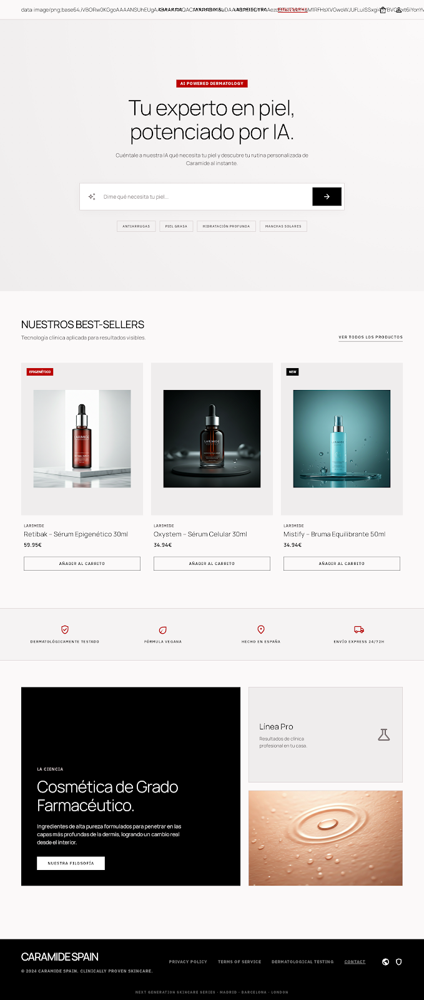

# Caramide AI Skincare Assistant 🧪✨

> **La experiencia interactiva de diagnóstico dermatológico clínico de próxima generación.**
> Potenciada por Inteligencia Artificial de vanguardia y diseñada con estética _Clinical Minimalist_ premium.



## 🔬 ¿Qué es Caramide AI Skincare Assistant?

Es una demo tecnológica interactiva y de alta gama creada para mostrar cómo la **Inteligencia Artificial conversacional** puede integrarse de forma fluida en la industria cosmética de lujo.

Este asistente clínico actúa como un consultor dermatológico personal en tiempo real dentro del Hero de la landing page. Analiza de inmediato los tipos de piel, imperfecciones, arrugas o necesidades de hidratación que el usuario introduce, y prescribe una **rutina científica personalizada** sugiriendo productos dermocosméticos de marcas reconocidas del sector (CeraVe, La Roche-Posay, The Ordinary, Vichy, Bioderma, etc.) con enlaces de búsqueda directos a **Amazon España** y **Google Shopping**.

---

## 🌟 Características Comerciales Clave

- **Recomendación agnóstica de mercado:** Cuando la IA sugiere un producto, adjunta automáticamente **enlaces de búsqueda a Amazon España y Google Shopping**, permitiendo al usuario comparar precios y comprar al mejor postor sin atarse a un único catálogo de marca.
- **Diseño Clínico Minimalista Exclusivo:** La landing page se adhiere de forma estricta y pixel-a-pixel al manual de diseño _Clinical Minimalist_: estructuras planas ("Flat Stack"), bordes de alto contraste de 1px, tipografía profesional (_Manrope_ e _IBM Plex Sans_) y el uso selectivo del color rojo clínico corporativo (`#bc0100`).
- **Interfaz Dinámica y Viva (Premium):**
  - **Efecto de Escritura Natural:** El chatbot redacta las recomendaciones de forma progresiva palabra por palabra (efecto _typewriter_ a 65ms), logrando una interacción inmersiva idéntica a ChatGPT o Gemini.
  - **Fondo de Luces de Laboratorio:** Un juego sutil de "luces de aurora" dinámicas en el fondo del Hero recrea visualmente la refracción de luz de laboratorio de biotecnología celular.
  - **Micro-interacciones táctiles:** Animaciones de entrada en cascada, transiciones fluidas de los prompt-chips y escalado reactivo en los botones principales.
- **Preferencia de Privacidad y Seguridad:** El backend está diseñado para ocultar por completo las claves API y realizar el procesamiento de forma segura en el servidor, garantizando que el sitio sea rápido, seguro y cumpla con altos estándares técnicos.

---

## 🛠️ Stack Tecnológico de Vanguardia

Para lograr tiempos de carga instantáneos en móviles y escritorio, y un SEO excelente, hemos seleccionado la tecnología más moderna:

- **Astro v7:** El framework más rápido para crear webs orientadas al rendimiento y contenido.
- **Tailwind CSS v4:** Motor de estilos ultraoptimizado utilizando variables CSS nativas.
- **OpenRouter (primario):** Enrutador gratuito de LLMs con `openrouter/free` como modelo por defecto, intercambiable vía variable de entorno.
- **Google Gemini 2.5 Flash (fallback):** Se activa automáticamente si el proveedor primario falla, garantizando disponibilidad continua.
- **Vercel Serverless:** Desplegado de forma global en la red perimetral de Vercel.
- **Playwright:** Suite completa de pruebas automatizadas y responsive (Chrome, Safari, Firefox) para asegurar un funcionamiento al 100% libre de bugs.

---

## 🚀 Despliegue en Vivo

El proyecto está completamente funcional y desplegado en producción en el siguiente enlace:
👉 **[caramide-ai-assistant.vercel.app](https://caramide-ai-assistant.vercel.app)**

---

## 🧑‍💻 Información para Desarrolladores

### Instalación Local

1.  **Clonar el repositorio:**
    ```bash
    git clone https://github.com/moisesvalero/caramide-ai-assistant.git
    cd caramide-ai-assistant
    ```
2.  **Instalar dependencias con pnpm:**
    ```bash
    pnpm install
    ```
3.  **Configurar las variables de entorno:**
    Crea un archivo `.env` en la raíz copiando el archivo `.env.example`:
    ```bash
    cp .env.example .env
    ```
    Introduce tus API keys en el `.env` (proveedor primario + fallback):
    ```env
    OPENROUTER_API_KEY=tu_clave_openrouter
    OPENROUTER_MODEL=openrouter/free
    GEMINI_API_KEY=tu_clave_gemini
    GEMINI_MODEL=gemini-2.5-flash
    ```
4.  **Iniciar modo desarrollo:**
    ```bash
    pnpm run dev
    ```
    Visita [http://localhost:4321](http://localhost:4321).

### Ejecutar Tests E2E y Responsive

```bash
pnpm exec playwright test
```

Los tests están mockeados para ejecutarse sin conexión a las APIs de IA, garantizando velocidad y costo cero en testing.

---

## 📄 Licencia

Este proyecto está bajo la licencia **PolyForm Noncommercial License 1.0.0**.

Puedes ver los términos completos en el archivo [LICENSE](LICENSE). Esta licencia permite el uso personal, educativo y de investigación, pero restringe estrictamente cualquier tipo de explotación comercial del software sin el consentimiento expreso del autor.

---

_Desarrollado con pasión clínica por **[Moisés Valero](https://moisesvalero.es)**._
